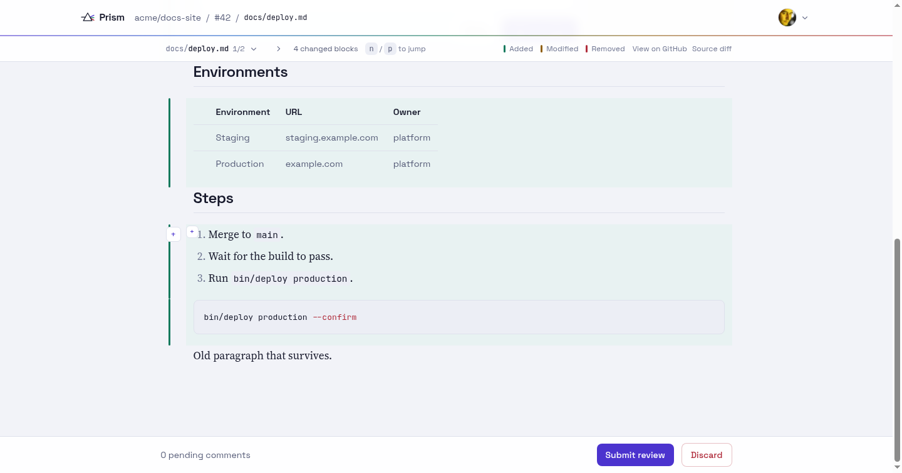

# Prism

Prism is a code-review layer on top of GitHub for the agentic era. Its first
feature: open a pull request, see the Markdown files it changes **rendered**,
and comment on a paragraph, heading, list item, table row or code block. Every
comment is posted to GitHub as a real pull request review comment anchored to
the source line behind that block, and existing GitHub comments show up next
to the rendered block they belong to.

Prism stores nothing but your account and your encrypted GitHub token. GitHub
is the only source of truth: pending reviews live on GitHub, so a page refresh
loses nothing, and if Prism vanished every comment would still be there.



## How it works

- Files are rendered with [commonmarker](https://github.com/gjtorikian/commonmarker)
  (GitHub-flavored Markdown) driven through its AST so every block knows its
  source line range.
- The pull request's diff hunks decide which lines GitHub will accept a comment
  on. A block whose lines fall inside a hunk gets a `+` in the gutter; a
  contiguous run of changed lines becomes a GitHub multi-line comment. Blocks
  outside the diff can still be commented on as a **file-level comment** that
  quotes the block and links to its lines, because GitHub's API refuses
  line comments outside the diff.
- Comments, replies, reactions, resolve/unresolve, @-mentions, Markdown
  preview, and Approve / Request changes / Comment reviews all go straight to
  GitHub (REST for simple calls, GraphQL for review threads and pending
  reviews).

See [`PLAN.md`](PLAN.md) for the architecture and mapping rules,
[`DESIGN.md`](DESIGN.md) for the design system, and
[`docs/research/`](docs/research/) for the verified GitHub API and Markdown
source-mapping research behind them.

## Running it

Everything runs in Docker; there is no host Ruby dependency.

1. Create a GitHub OAuth App at <https://github.com/settings/developers> with
   the callback URL `http://localhost:3004/auth/github/callback`.
2. `cp .env.example .env` and paste the app's Client ID and Client Secret into
   `GITHUB_CLIENT_ID` / `GITHUB_CLIENT_SECRET`. The other values in
   `.env.example` are working development defaults.
3. `docker compose up -d`
4. Open <http://localhost:3004> and sign in with GitHub.

Prism asks for the `repo`, `read:org` and `read:user` scopes. `repo` is the
only GitHub scope that can post a review comment on a private repository.

| Service | Port | Purpose |
| --- | --- | --- |
| `app` | 3004 | Rails |
| `postgres` | 5436 | Postgres 16 |
| `css` | – | Tailwind watcher |

After changing the `Gemfile`, rebuild: `docker compose build app && docker compose up -d`.

## Tests

```bash
docker compose exec app bin/rails test            # unit + integration
docker compose exec app bin/rails test:system     # browser-driven, headless Chromium
docker compose exec app bin/rubocop
docker compose exec app bin/brakeman --no-pager
```

GitHub is never called from tests; every request is stubbed with WebMock.
[`docs/testing.md`](docs/testing.md) describes the end-to-end feature specs and
the opt-in live tier that runs against a scratch pull request.

## Working on it

[`AGENTS.md`](AGENTS.md) is the guide for contributors and coding agents:
conventions, the `Github::Client` contract, and the rules for rendered
Markdown and sanitization.
