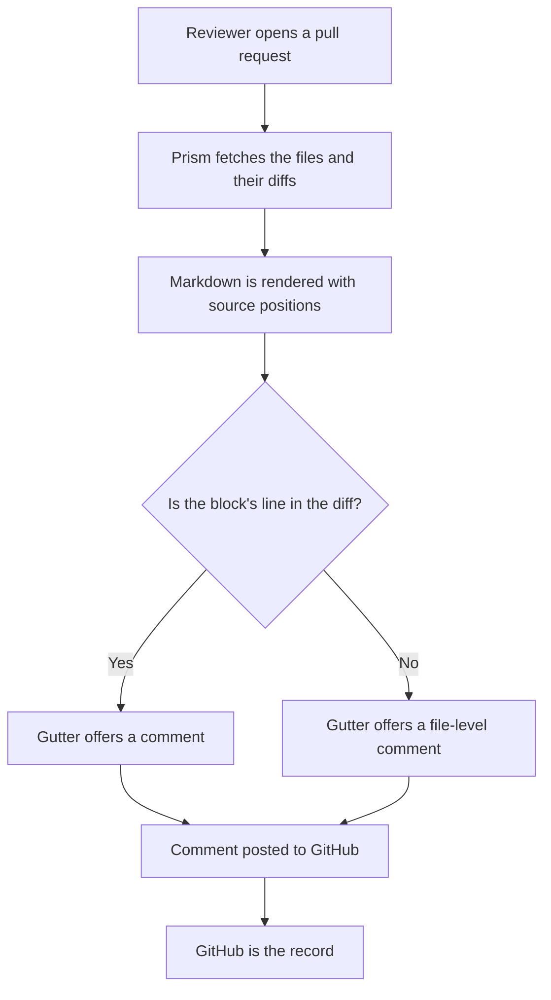
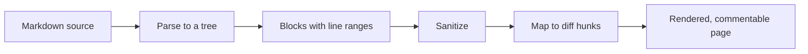
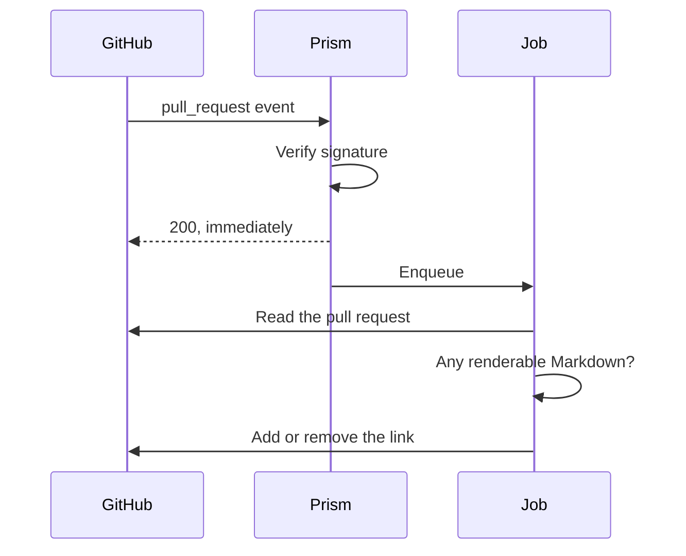

# How Prism works

Three things happen in Prism, and they are easier to follow as pictures than as
prose. This is the map; `PLAN.md` is the territory.

## The review flow

Everything a reviewer does starts and ends at GitHub. Prism holds no comments,
no drafts and no pull request state — it renders, translates, and hands work
back.

The question in the middle is the whole product. GitHub will only accept a
review comment on a line that appears inside a diff hunk, so a rendered
paragraph is commentable only if the lines behind it changed. Where it cannot
anchor, Prism says so and offers the fallback rather than failing quietly.

## Rendering a block

The renderer walks the Markdown syntax tree rather than parsing its own HTML
output, because the tree knows where every block started and ended and the HTML
does not.

A block carries the range of source lines it came from. That range is what a
comment is anchored to, which is why the code block behind a diagram stays in
the page even once the diagram is drawn over it.

## The webhook

When a repository is watched, Prism keeps a link to its own review page in the
pull request's description, and keeps it honest as the pull request changes.

The acknowledgement comes before the work, because GitHub is waiting and the
work involves calling GitHub back. Everything after that is convergent: the job
asks what should be true and fixes the difference, so a redelivery, a second
push and an out-of-order event all reach the same answer.

| Event | What Prism does |
| --- | --- |
| `opened` | Adds the link if the pull request changes Markdown |
| `synchronize` | Adds or removes it as Markdown comes and goes |
| `edited` | Nothing — Prism's own edit produces one of these |

That last row is not an oversight. Acting on it would loop forever.
